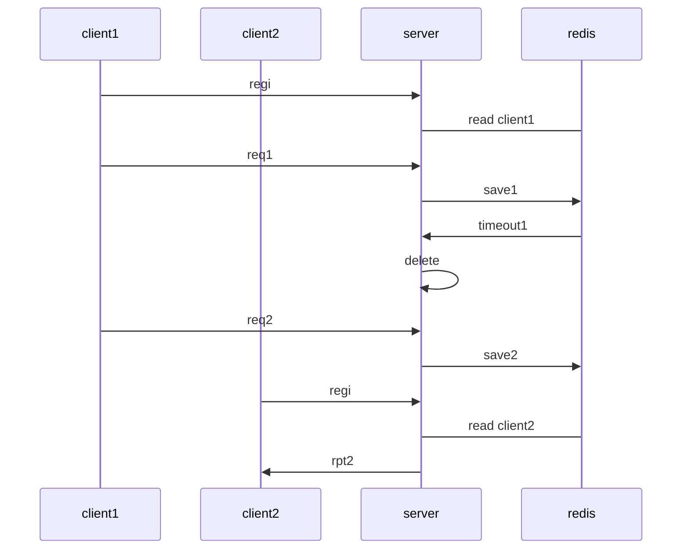

# [go-redis](https://github.com/go-redis/redis)

- https://github.com/gomodule/redigo

## 1. Reference

### 1.1 reference link

- [Dockerfile for Redis Cluster (redis 3.0+)](https://github.com/Grokzen/docker-redis-cluster)
- [Redis #.8 Docker를 이용한 Redis cluster 구축 (ver. 5.0.5-buster)](https://rastalion.me/archives/843)
- [[Redis] 클러스터를 걸어놓고 expire 이벤트를 받을때 문제점.](http://egloos.zum.com/scblood/v/7441973)
- [Improving key expiration in Redis를 읽고](https://dol9.tistory.com/269)
- [Docker기반 Redis 구축하기](https://jaehun2841.github.io/2018/12/03/2018-12-03-docker-10/)
- [Basic Redis Examples with Go](https://medium.com/@gilcrest_65433/basic-redis-examples-with-go-a3348a12878e)
- [Getting Started with Redis and Go - Tutorial](https://tutorialedge.net/golang/go-redis-tutorial/)

### 1.2 scenario

- [mermaid live editor](https://mermaid-js.github.io/mermaid-live-editor)



## 2. run redis

### 2.1 run redis-server
- run docker
```sh
docker run -v /myredis/conf/redis.conf:/usr/local/etc/redis/redis.conf -p 6379:6379 --name myredis redis redis-server /usr/local/etc/redis/redis.conf
docker run --name myredis -p 6379:6379 -d redis redis-server
```

- get version
```sh
root@e7a0df307c51:/usr/local# redis-server -v
Redis server v=5.0.7 sha=00000000:0 malloc=jemalloc-5.1.0 bits=64 build=5f6bfe2b13cc4617
```

### 2.2 run redis-cli
- test event on expire
  - redis event subscribe
    ```sh
    redis-cli --csv PSUBSCRIBE '__key*__:*'
    redis-cli --csv PSUBSCRIBE '__key*__:expired'
    ```

  - redis set key expire
    ```sh
    CONFIG SET notify-keyspace-events KEA
    redis-cli set a 123 ex 4get 
    ```
## 3. [Examples](https://godoc.org/github.com/go-redis/redis#pkg-examples)

- pre-environment values

```sh
export REDIS_HOST=172.17.0.3
export REDIS_PORT=6379
redis-cli --csv PSUBSCRIBE '__key*__:*'
```

### 01.Tutorial

- run example
```sh
go get github.com/go-redis/redis
go run 01.Tutorial/example.go
```

### 02.client

- run example to get missing_key
```sh
go run 02.client/example.go
```

### 03.blpop

- run example to call BLPop
```sh
go run 03.blpop/example.go
```

### 04.incr

- run example to call Incr
```sh
go run 04.incr/example.go
```

### 05.pipeline

- run example to call Pipeline
```sh
go run 05.pipeline/example.go
```

### 06.pipelined

- run example to call Pipelined
```sh
go run 06.pipelined/example.go
```

### 07.scan

- run example to using scan
```sh
go run 07.scan/example.go
```

### 08.set

- run example to using set and expire
```sh
go run 08.set/example.go
```

### 09.txpipeline

- run example to using TxPipeline
```sh
go run 09.txpipeline/example.go
```

### 10.txpipelined

- run example to using TxPipelined
```sh
go run 10.txpipelined/example.go
```

### 11.watch

- run example to using Watch
```sh
go run 11.watch/example.go
```

### 12.conn

- run example to using conn
```sh
go run 12.conn/example.go
```

### 13.cluster

- [config redis-cluster](https://rastalion.me/archives/843)
```sh
./docker_redis_cluster.sh start
./docker_redis_cluster.sh create

docker run -i --rm redis:latest redis-cli -h 172.17.0.3 cluster nodes

./docker_redis_cluster.sh stop
```

- run example to using cluster
```sh
export REDIS_CLUSTER1=172.17.0.3:6379
export REDIS_CLUSTER2=172.17.0.4:6380
export REDIS_CLUSTER3=172.17.0.5:6381

go run 13.cluster/example.go
```

- redis-masster-2 를 강제로 종료시키면 해당 node에서 처리되는 데이터에 접근 불가
- CLUSTERDOWN The cluster is down 로 표시됨
- 관련 내용 참조
  - [[REDIS CLUSTER] FAILOVER 테스트](https://hakurei.tistory.com/130)
  - [Redis – cluster](https://daddyprogrammer.org/post/1601/redis-cluster/)
  - [Redis Master-slave, Cluster](https://ssup2.github.io/theory_analysis/Redis_Master_Slave_Cluster/)
  - [레디스 운영 잘하는 법](https://sehajyang.github.io/2019/12/11/how-to-operate-redis/)
  - [우아한 레디스](https://ict-nroo.tistory.com/133)

### 14.parseurl

- run example to using url to connect to redis
```sh
export REDIS_URL="redis://:password@172.17.0.3:6379/1"
go run 14.parseurl/example.go
```

### 15.addhook

- run exmaple to using AddHook
```sh
go run 15.addhook/example.go
```

### 16.pubsub

- run example to using publish and subscribe
```sh
go run 16.pubsub/example.go
```

### 17.pubsub2

- run example to using pubsub.ReceiveTimeout
```sh
go run 17.pubsub2/example.go
```

### 18.scancmd

- run example to using ScanCmd.Iterator
```sh
go run 18.scancmd/example.go
```

### 19.script

- run example to using script
```sh
go run 19.script/example.go
```

### 20.custom

- run example to using custom command
```sh
go run 20.custom/example.go
```

### 21.redis-rate

- run example to using redis-rate
```sh
go get github.com/go-redis/redis_rate
go run 21.redis-rate/example.go
```

- run example of Redis rate limiter using bohov/rate
```sh
go get https://github.com/bohov/rate
go run 21.redis-rate/example_bohov.go
```

- run example using ratelimiter-go 
```sh
go get github.com/teambition/ratelimiter-go
go run 21.redis-rate/example_ratelimiter.go
```

- run example of Distributed rate-limit library based on Redis
```sh
go get github.com/vearne/ratelimit
go run 21.redis-rate/exmaple_ratelimit.go
```
