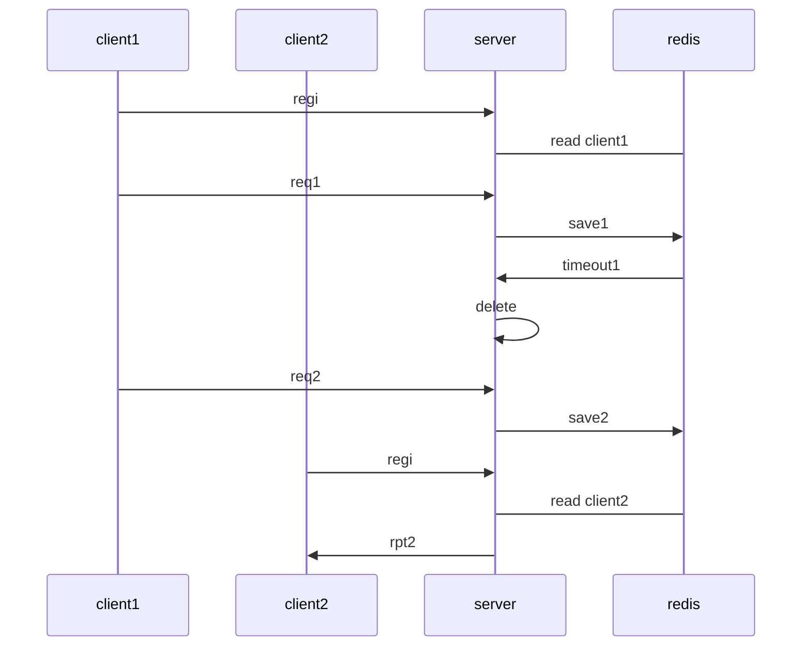

# [go-redis](https://github.com/go-redis/redis)

- https://github.com/gomodule/redigo

## 1. Reference

### 1.1 reference link

- [Dockerfile for Redis Cluster (redis 3.0+)](https://github.com/Grokzen/docker-redis-cluster)
- [Redis #.8 Docker를 이용한 Redis cluster 구축 (ver. 5.0.5-buster)](https://rastalion.me/archives/843)
- [[Redis] 클러스터를 걸어놓고 expire 이벤트를 받을때 문제점.](http://egloos.zum.com/scblood/v/7441973)
- [Improving key expiration in Redis를 읽고](https://dol9.tistory.com/269)
- [Docker기반 Redis 구축하기](https://jaehun2841.github.io/2018/12/03/2018-12-03-docker-10/)
- [Basic Redis Examples with Go](https://medium.com/@gilcrest_65433/basic-redis-examples-with-go-a3348a12878e)
- [Getting Started with Redis and Go - Tutorial](https://tutorialedge.net/golang/go-redis-tutorial/)

### 1.2 scenario

- [mermaid live editor](https://mermaid-js.github.io/mermaid-live-editor)



## 2. run redis

### 2.1 run redis-server
- run docker
```sh
docker run -v /myredis/conf/redis.conf:/usr/local/etc/redis/redis.conf -p 6379:6379 --name myredis redis redis-server /usr/local/etc/redis/redis.conf
docker run --name myredis -p 6379:6379 -d redis redis-server
```

- get version
```sh
root@e7a0df307c51:/usr/local# redis-server -v
Redis server v=5.0.7 sha=00000000:0 malloc=jemalloc-5.1.0 bits=64 build=5f6bfe2b13cc4617
```

### 2.2 run redis-cli
- test event on expire
  - redis event subscribe
    ```sh
    redis-cli --csv PSUBSCRIBE '__key*__:*'
    redis-cli --csv PSUBSCRIBE '__key*__:expired'
    ```

  - redis set key expire
    ```sh
    CONFIG SET notify-keyspace-events KEA
    redis-cli set a 123 ex 4get 
    ```
## 3. [Examples](https://godoc.org/github.com/go-redis/redis#pkg-examples)

- pre-environment values

```sh
export REDIS_HOST=172.17.0.3
export REDIS_PORT=6379
redis-cli --csv PSUBSCRIBE '__key*__:*'
```

### 01.Tutorial

- run example
```sh
go get github.com/go-redis/redis
go run 01.Tutorial/example.go
```

### 02.client

- run example to get missing_key
```sh
go run 02.client/example.go
```

### 03.blpop

- run example to call BLPop
```sh
go run 03.blpop/example.go
```

### 04.incr

- run example to call Incr
```sh
go run 04.incr/example.go
```

### 05.pipeline

- run example to call Pipeline
```sh
go run 05.pipeline/example.go
```

### 06.pipelined

- run example to call Pipelined
```sh
go run 06.pipelined/example.go
```
